#### **HW 8 Project - Implement Final Chart**
#### CS 625
#### Fall 2022

##### **Author**: Aarya Kankipati
##### **UIN:** 01211068
##### **Date:** December 08, 2022


[Google Colab Notebook](https://colab.research.google.com/drive/1N443FuB-0WsUA9w89ZhIIx74-Fj4I59I?usp=sharing)

## **Part 1: Choose a Dataset**

Coronavirus disease (COVID-19) is an infectious disease caused by the SARS-CoV-2 virus. The majority of virus-infected individuals will have mild to severe respiratory disease and will recover without the need for special care. However, some people will get serious illnesses and need to see a doctor. Serious sickness is more likely to strike older persons and those with underlying medical illnesses including cancer, diabetes, cardiovascular disease, or chronic respiratory diseases. COVID-19 can cause anyone to get very ill or pass away at any age. I want to correlate the total deaths happened in USA by each state and the relief fund which was allocated to hospital by categorizing them by state.


For my project, I choose the dataset of Deaths involving coronavirus disease 2019 (COVID-19), pneumonia, and influenza were reported to NCHS by sex, age group, and jurisdiction of occurrence as primary dataset and Provider Relief Fund COVID-19 High-Impact Payments as secondary dataset.

### *Primary Dataset*
**Provisional COVID-19 Deaths by Sex and Age**

The National Center for Health Statistics (NCHS) is disseminating the death data from the National Vital Statistics System (NVSS) on a daily and weekly basis in response to the COVID-19 epidemic. These statistics, which include counts of COVID-19-related deaths by age, gender, race, and Hispanic origin as well as place of death, as well as details on additional health conditions and comorbidities that contributed to these deaths, are taken directly from death certificates that have been filed at the state and local levels. 

The dataset contains a variety of columns relating to COVID fatalities. I'm going to concentrate more on the fatalities caused by COVID and categorize them by age and gender. With the help of this initiative, we will be able to tie data on the COVID 19 immunization to mortality according to age and gender in the future. We may expand this data to include other areas and cities.


The Primary dataset contains 107406 rows with 16 columns. There are different characteristics in the dataset.

* **Data As Of**	*Date of analysis*
* **Start Date**	 *First date of data period*
* **End Date**	       *Last date of data period*
* **Group**		*Indicator of whether data measured by Month, by Year, or Total*
* **Year**	 	*Year in which death occurred*
* **Month**		*Month in which death occurred*
* **State**		*Jurisdiction of occurrence*
* **Sex**			*Sex*
* **Age Group**			*Age group*
* **COVID-19 Deaths**		*Deaths involving COVID-19 (ICD-code U07.1)*
* **Total Deaths**    	*Deaths from all causes of death*
* **Pneumonia Deaths**	*Pneumonia Deaths (ICD-10 codes J12.0-J18.9)*
* **Pneumonia and COVID-19** *Deaths	Deaths with Pneumonia and COVID-19 (ICD-10 codes J12.0-J18.9 and U07.1)*
* **Pneumonia, Influenza, or COVID-19 Deaths**	*Deaths with Pneumonia, Influenza, or COVID-19 (ICD-10 codes U07.1 or J09-J18.9)*
* **Footnote**	*Suppressed counts (1-9)*

*Reference for the dataset source (CDC) <https://data.cdc.gov/NCHS/Provisional-COVID-19-Deaths-by-Sex-and-Age/9bhg-hcku>*


### *Secondary Dataset*

**Provider Relief Fund COVID-19 High-Impact Payments**

Hospitals in High Impact Zones are receiving two rounds of payments from the Department of Health and Human Services through the Health Resources and Services Administration for positive COVID-19 admissions. Twelve billion dollars were given out in the first round of the High Impact Allocation to roughly 400 institutions who treated 100 or more COVID-19 patients while they were hospitalized. 

Based on their Medicare disproportionate share and uncompensated care payments, these hospitals received $2 billion of these payments. $10 billion will be allocated to hospitals with more than 161 COVID-19 admissions in the second round of financing.

We have selected Provider Relief Fund COVID-19 High-Impact Payments dataset as the supplementary dataset. A relief fund is a sum of money established to help those in need, particularly in disaster zones or communities that are severely impacted by COVID 19. The money is given to hospitals to help them treat covid patients. With the use of this dataset, we can investigate whether the government's allocation of cash to each state in relation to the covid mortality rate was reasonable.

The Secondary dataset contains 1197 rows with 6 columns. There are different characteristics in the dataset.

* **Name**		*Provider name of the hospital.*
* **City**	 	*City name*
* **State**		*State name*
* **Returned (1st Payment)**	*Data funds were returned*
* **1st Round Payment**			*The amount allocated for the provider in the COVID-19 High-Impact Allocation during 1st round of payments*
* **2nd Round Payment**			*The amount allocated for the provider in the COVID-19 High-Impact Allocation during 2nd round of payments*

Each row is a provider who received a payment from the COVID-19 High-Impact Allocation from the Provider Relief Fund.


*Reference for Provider Relief Fund COVID-19 High-Impact Payments   <https://data.cdc.gov/Administrative/Provider-Relief-Fund-COVID-19-High-Impact-Payments/b58h-s9zx>*


## Part 2: Start the EDA Process

### Data Manipulation

We will use our data set from the National Center for Centers for Disease Control and Prevention that is relevant to COVID-19 instances to further analyze and study the data in order to uncover some insightful information. The dataset's characteristics will be as follows:

* **Data As Of**	*Time series*
* **Start Date**	 *Time series*
* **End Date**	       *Time series*
* **Group**		*Categorical*
* **Year**	 	*Time series*
* **Month**		*Time series*
* **State**		*Categorical*
* **Sex**			*Categorical*
* **Age Group**			*Categorical*
* **COVID-19 Deaths**		*Numeric*
* **Total Deaths**    	*Numeric*
* **Pneumonia Deaths**	*Numeric*
* **Pneumonia and COVID-19** *Numeric*
* **Pneumonia, Influenza, or COVID-19 Deaths**	*Numeric*


We will use our secondary data set from the Health Resources and Services Administration for Provider Relief Fund COVID-19 High-Impact Payments instances to further analyze and study the data to uncover some insightful information. The dataset's characteristics will be as follows:

* **Name**		*Categorical*
* **City**	 	*Categorical*
* **State**		*Categorical*
* **Returned (1st Payment)**	*Numeric*
* **1st Round Payment**			*Numeric*
* **2nd Round Payment**			*Numeric*

For the data manipulations, as we need specific data with the two datasets, we are going to use python to alter the data. We are going to import the datasets by using the pandas library. We are using Google colaboratory notebook and link for google colaboratory is attached above.


```R

#To read csv file(data)

import pandas as pd 
df2= pd.read_csv('/content/Provisional-COVID-19-Deaths.csv')


```

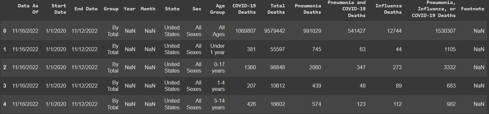

We must filter out particular data which we want, and we can use the below command to filter. We need only "By Total" values in the group column from the COVID deaths dataset.

```R
#Filtering out required column values

df2 = df2[df2['Group'].str.contains('By Total')]
df2.head(5)

```
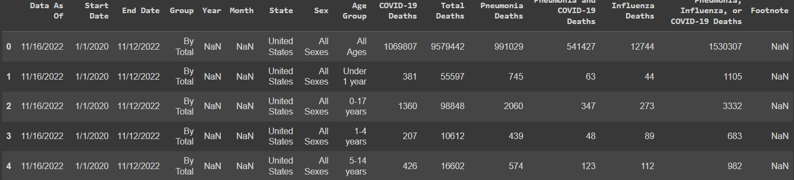

As we have 16 columns, but we do not use every column. In the data cleaning process, we need to drop or delete unnecessary columns from our primary dataset. The columns which are not useful for our final goal are start Date, Data As Of, End Date, Footnote, Month, Year from the covid deaths dataset.

```R

#Dropping the columns which are not necessary

del df2["Start Date"],df2["Data As Of"],df2['End Date'],df2['Footnote'],df2["Month"],df2['Year']
df2.head(5)

```
This is the filtered primary dataset that we use for this project and to generate questions.

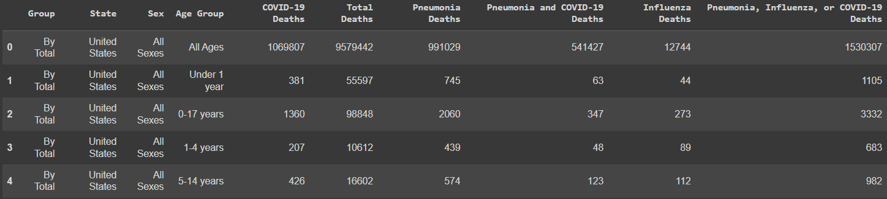

Similarly, we also need to clean the data in the secondary dataset. We are going to import secondary dataset using pandas and observe it.


```R

#To read csv file(data)

import pandas as pd 
df1= pd.read_csv("/content/Provider_Relief_Fund_COVID-19_High-Impact_Payments.csv")

```

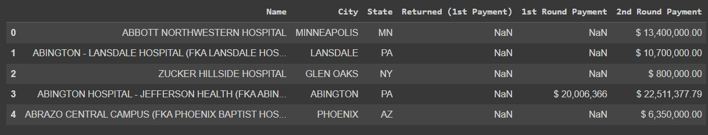

We are using describe function below to check the the secondary dataset which returns description of the data in the DataFrame.

```R

df1.describe()

```

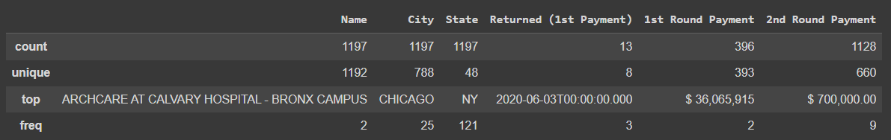

We can analyze that states in the secondary dataset are in abbreviations. To merge with the primary data, we need to change the state abbreviation into the state name.

```R

# changing state abbreviation into state name
states = {
      
            'AL': 'Alabama',
            'AK': 'Alaska',
            'AZ': 'Arizona',
            'AR': 'Arkansas',
            'CA': 'California',
            'CO': 'Colorado',
            'CT': 'Connecticut',
            'DE': 'Delaware',
            'FL': 'Florida',
            'GA': 'Georgia',
            'HI': 'Hawaii',
            'ID': 'Idaho',
            'IL': 'Illinois',
            'IN': 'Indiana',
            'IA': 'Iowa',
            'KS': 'Kansas',
            'KY': 'Kentucky',
            'LA': 'Louisiana',
            'ME': 'Maine',
            'MD': 'Maryland',
            'MA': 'Massachusetts',
            'MI': 'Michigan',
            'MN': 'Minnesota',
            'MS': 'Mississippi',
            'MO': 'Missouri',
            'MT': 'Montana',
            'NE': 'Nebraska',
            'NV': 'Nevada',
            'NH': 'New Hampshire',
            'NJ': 'New Jersey',
            'NM': 'New Mexico',
            'NY': 'New York',
            'NC': 'North Carolina',
            'ND': 'North Dakota',
            'OH': 'Ohio',
            'OK': 'Oklahoma',
            'OR': 'Oregon',
            'PA': 'Pennsylvania',
            'RI': 'Rhode Island',
            'SC': 'South Carolina',
            'SD': 'South Dakota',
            'TN': 'Tennessee',
            'TX': 'Texas',
            'UT': 'Utah',
            'VT': 'Vermont',
            'VA': 'Virginia',
            'WA': 'Washington',
            'WV': 'West Virginia',
            'WI': 'Wisconsin',
            'WY': 'Wyoming',
            'DC': 'District of Columbia',
            'MP': 'Northern Mariana Islands',
            'PW': 'Palau',
            'PR': 'Puerto Rico',
            'VI': 'Virgin Islands',
            'AA': 'Armed Forces Americas (Except Canada)',
            'AE': 'Armed Forces Africa/Canada/Europe/Middle East',
            'AP': 'Armed Forces Pacific'
    }

states = {state: abbrev for state, abbrev in states.items()}
df1['State'] = df1['State'].map(states)


df1['State'] = df1['State'].replace(states)

```
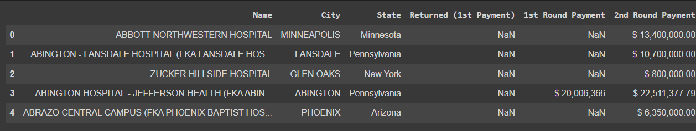

After getting two datasets altered, we can merge them into a new dataset. The "State" column is the key for both datasets. So, We are going to use the merge function concerning the state to merge the datasets.

```R

df=pd.merge(df1,df2,on='State')
df.head(5)

```

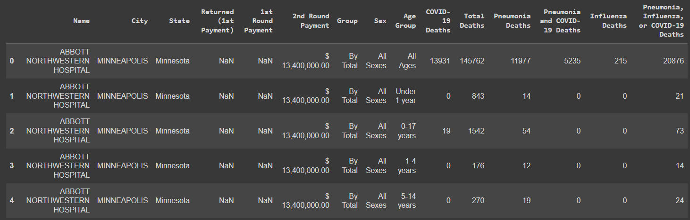

After merging two datasets into one, we can see there are few alterations need to complete before using this dataset.
We are going to fill the round payments blank values as zero. We are also going to delete the Returned (1st payment) column from this dataframe. Also, we can filter the dataframe by removing all ages and all sexes values from the columns age group and sex respectively form the dataframe.


```R

df['1st Round Payment'] = df['1st Round Payment'].fillna(0)
df['2nd Round Payment'] = df['2nd Round Payment'].fillna(0)

del df['Returned (1st Payment)']

df.drop(df.index[df['Age Group'] == 'All Ages'], inplace = True)
df.drop(df.index[df['Sex'] == 'All Sexes'], inplace = True)

df.head(5)
```

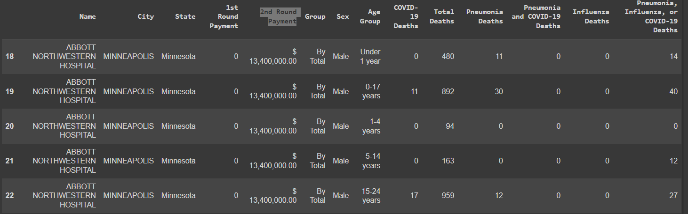


The below describe function returns a description of the data in the final DataFrame (Merged Dataframe). The shape function will give us the rows and columns of the data frame. We have a total of 38272 rows of data with 14 columns.

```R

print(df.describe())
df.shape

```
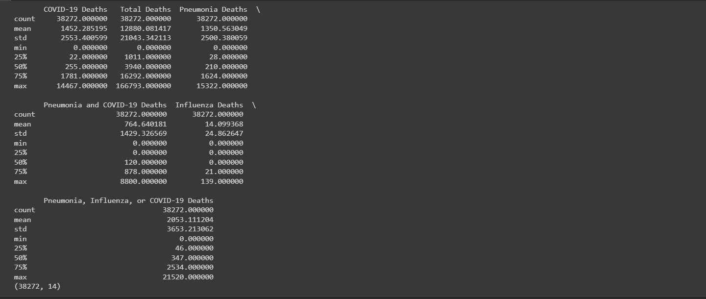

The below commmand is used to convert the dataframe in to CSV file to export.

```R
df.to_csv('Covid-deaths-funds.csv')

```

After merging and downloading the dataset, we can open it in excel and need to make a few changes. We are going to add both 1st payment fund and 2nd payment fund and created a new column with a total of both columns. The process is shown below.


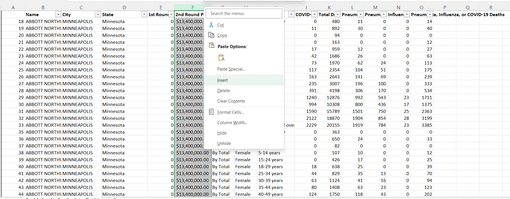

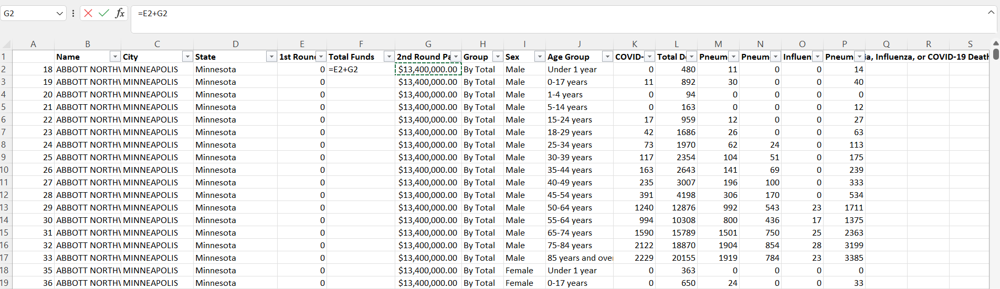


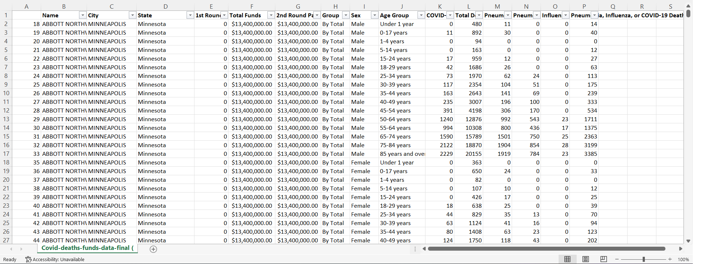

Finally, we got our final dataset which is ready to use for data visualization. I am going to use Tableau to generate charts and tableau workbooks are also attached in this GitHub folder.


### **EDA Process**

Similar to my last research, we came up with two queries about the total fatalities by age and year as well as the overall covid death rate by state in the United States. We only have categorical columns for death rate information like age and sex in the original dataset. 

We intend to develop the exploratory data analysis with more intriguing data-driven queries in the next phase. There is a lot of information that can be shown and used to assist doctors and educate the general public because I also have the secondary dataset and I combined the two datasets into one new dataset. Death rate in united and relief fund should be justified to hospitals, Our main goal is to check whether the hospitals getting justified amount of funds based on deaths in city or state.

It is crucial for the general public to understand how much the government approved for the relief fund and how much it really supplied since my secondary dataset is the relief money that was granted to the hospitals that are experiencing the biggest death rate problem at the moment. We are using tableau to create them and visualize the charts. We have also uploaded our *tableau workbook* for reference. We will thus come up with the following specific questions using the merged dataset. 


**The Change from first-round payment to second-round payment in the United States from city to state.**

These are the key documents in the secondary dataset that provide excellent visualizations. We may use the comparing values by a bar chart before going through a difficult process of interpreting the data in the second dataset. 

People need to know how much the relief money is allotted to each hospital in their city and state because the Secondary dataset includes relief funds. Comparing the first round fund and second round funds organized by state, city, and afterwards hospital name is the best approach to accomplish it. 

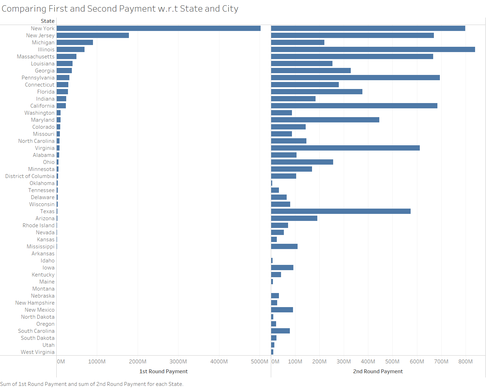

We can easily see the difference between first and second-round payouts from the visualization chart up above. In the initial round of payment, New York has the highest amount, followed by New Jersey and Michigan. The second-round payout, however, is where Illinois tops the list, followed by New York. To view the precise round payment values for each state, move the pointer over the states on the chart.

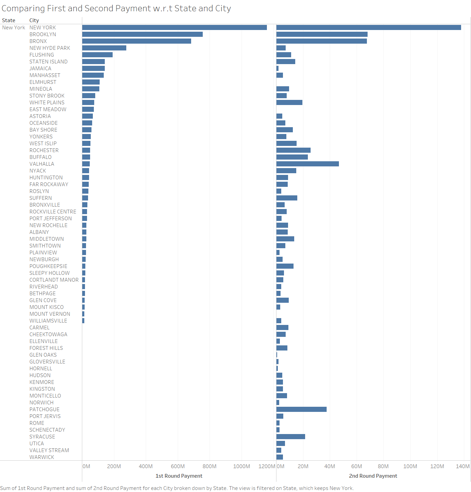

We chose New York to check the condition of the city since it received the highest first round payout and the second highest second round payment. Here, we can see how much money is given to each city from the fund. Because it has the highest death rate crisis, New York City, the busiest city, has the highest funds.

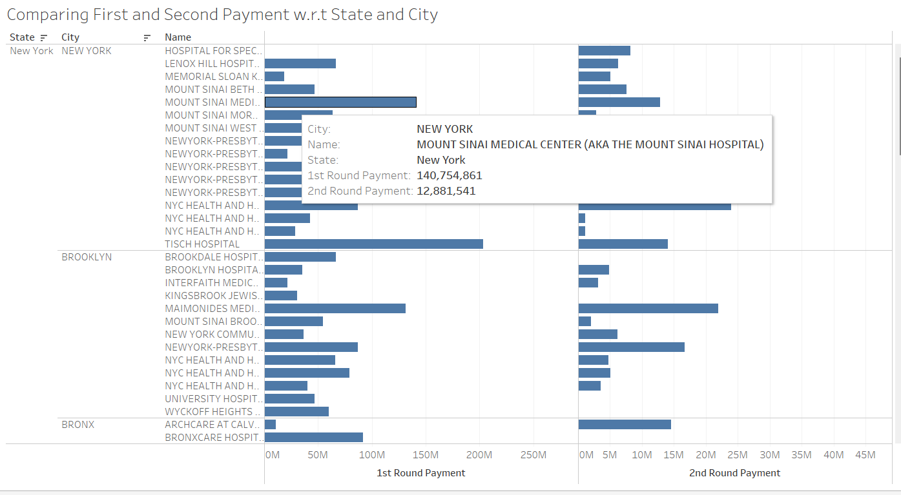

Later on, we can also see the hospitals that the government is funding. It will describe all the information below for me while we are hovering over the hospital. In light of this, comparing the first and second rounds of payment with hospitals, cities, and states is simple.

**Geographical representation of states with death rate along with relief funds in the United States**

We need to further explore our new data, i.e., include deaths and relief funding, as we integrated our two datasets. Therefore, we are going to create a geographical map that includes the overall death rate in each state in the United States as well as the first and second payment amounts.

To create this graphic, we also utilized Tableau. Additionally, we used color to depict the overall death rate, with dark states having the highest rates and bright states having the lowest. Additionally, we included the money to the graphic.

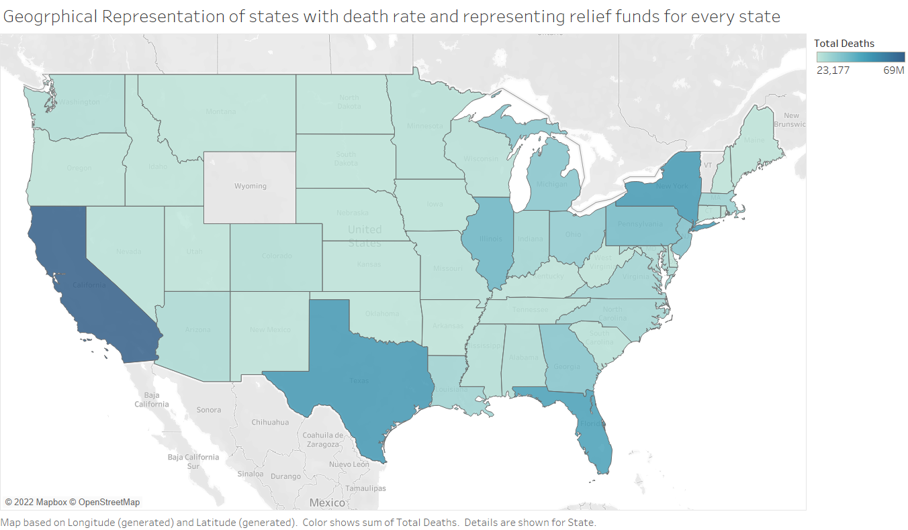
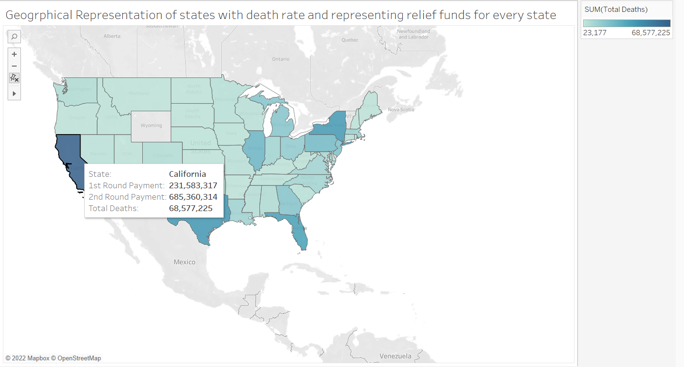

We can see which state has more mortality rate crises and which state experiences the least from the aforementioned charts. As we can see, Wyoming has no color, which indicates that it has a very, very low mortality rate, whereas California has the deepest color and the greatest death rate. 

The minimum mortality rate in the states is 23,177, and the greatest death rate is 68,577,225. Additionally, you may see the above-described city, first-round payment, and second-round payment data when you hover your cursor over the states.

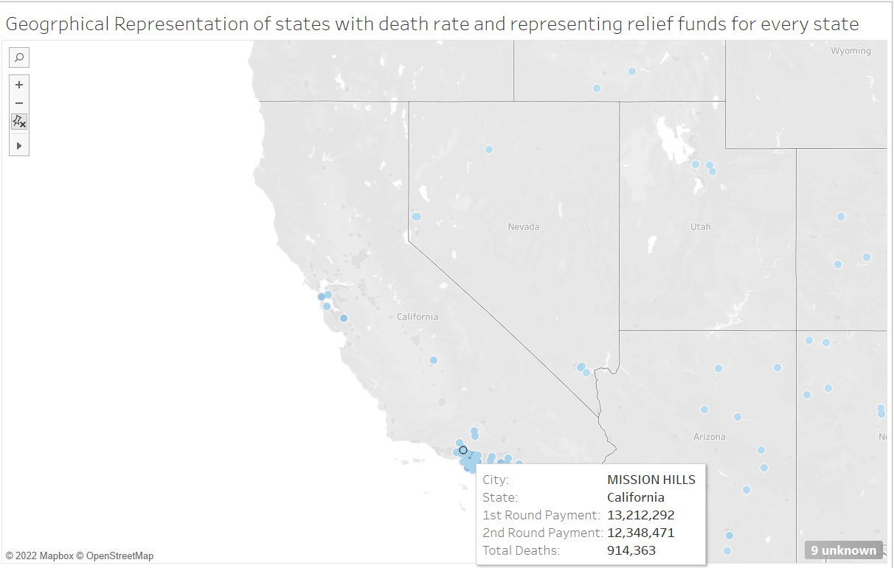

In the same way that we may choose one or more states to view in-depth information for, we can also evaluate the city. California was our choice since it is the highest. And you can see that there are deaths in every city. Additionally, you may see the above-described city, first-round payment, and second-round payment data when you hover your cursor over the states.


**Death rate Categorized by age group from states to cities in the United States**
There is also an intriguing question regarding the ages of the deceased that will aid hospitals in determining which ages are at risk or which ages have more or lesser immunity. In order for both the general public and medical professionals can identify which age group poses the most concern, we are creating a dispersed graph using Tableau. *Which age group has the most risk in each state and city?*

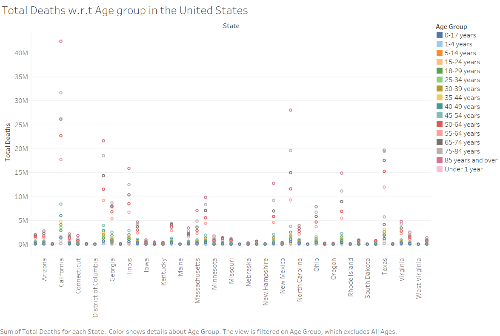

We may view the age groups and associated mortality by age from the above dispersed graph (distribution chart). In order to make it simple to distinguish which color bubble is at the top and has the most fatalities in that area, we developed age in color mode for the dispersed graph.

According to the aforementioned graph, California has the highest mortality rate and the "85 Years and Over" age group has the highest death rates. When compared to other age groups, "85 Years and Over" has the greatest percentage in most states. We can infer that elderly folks are most at risk of being covered.

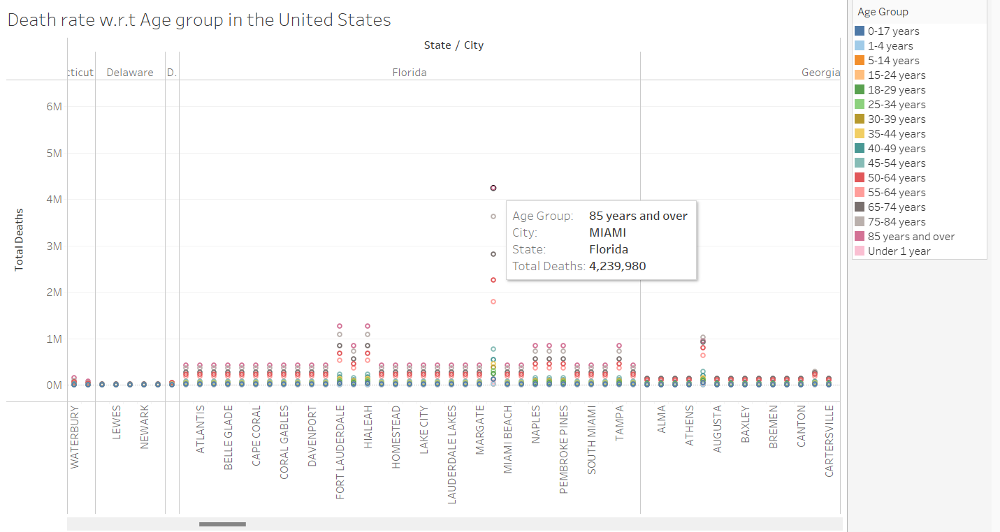

The death rate in cities with the age group is also visible when selecting states in the scattered graph above. In order to evaluate additional information about the death rate by age group, we chose the state of Florida.
The graph shows that Miami has Florida's highest mortality rate, and that "85 years and older" is Miami's highest age group, followed by "75-84 years." If we examine closely, we can notice that most Floridan communities have the greatest percentage of "85 years and above." In summary, we can state that older persons are more at risk for COVID and have a higher fatality rate.


### **Final Chart**

#### **Does Government justify the relief fund for hospitals in every state with a death rate?**

**Relation between Total deaths and Relief funds given by Government**

For the final chart, We now attempt to create comparison maps for total funds and other death-related concerns across the US. We put our data into Tableau and plot the COVID-19 fatalities, pneumonia deaths, and influenza deaths.

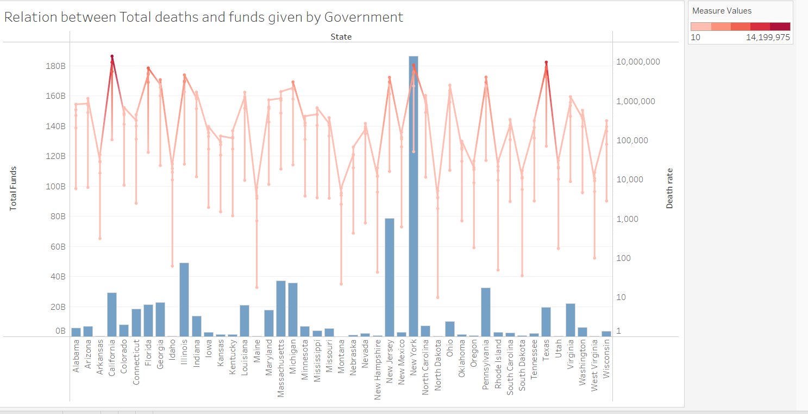

We can also differentiate the line charts individually to analyze the data clearly. Here, Each line chart explains their death rates and also the total funds relation.

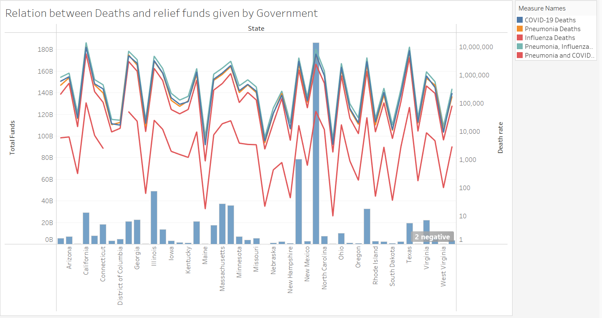

For our final graph, we need a correlation between total deaths and the total relief funds given to the hospital according to the states in the United States. We can also use scattered graphs to look at and analyze the correlation between them.

From the graph, we can check whether the government gave the relief fund according to the total deaths or not. From the below chart, we can say California has more total deaths but less relief fund and Neyork has high relief fund but fewer total deaths comparatively.

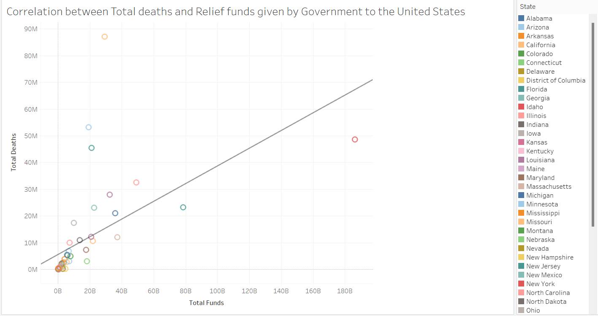

To know all the death-related diseases, we are going to use the combo bar chart which is best to compare the funds and also the total deaths regarding each disease.

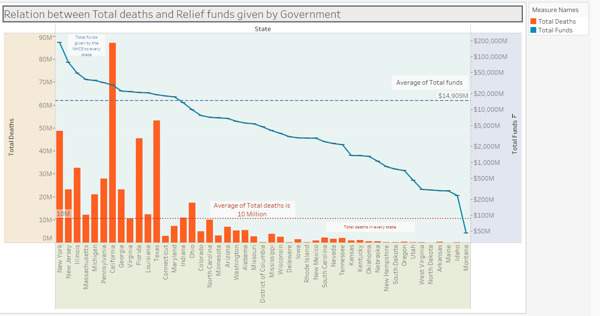

To know all the death-related diseases, we are going to use the combo bar chart which is best to compare the funds and also the total deaths regarding each disease.
From our final graph, we can analyze that it is a combination of both total funds and also total deaths in the united states.

The red bar chart represents the total number of deaths that happened in each and every state. We can say California is the highest death rate.

The red dotted line is the average total death count in the united states which is 10M.

The blue line chart represents the total relief funds that are given by the government to each state individually. Newyork has received the highest relief fund from the government, but still, New York death cases are not much high as the relief fund.


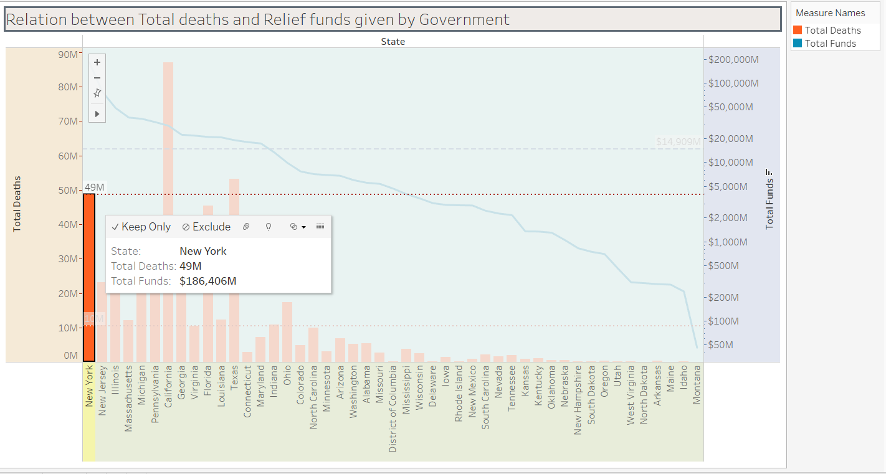

If we select any one of the states, we can also see how much the relief fund is given to each jurisdiction or city in that state. We selected Newyork as an example.

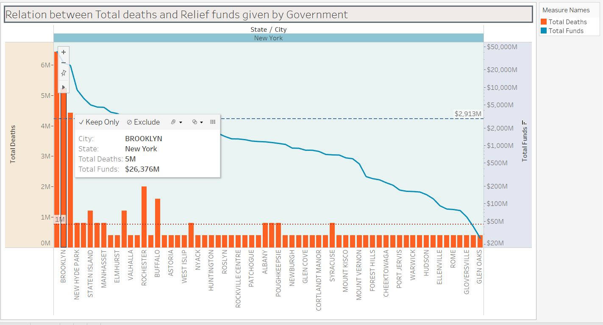

Here, we can analyze each and every city in the state of New York and compare the relief fund with the total deaths in that city. From above, we can see that Brooklyn from the city of new york has 5 million total deaths and the Government gave nearly 26,376 Million as relief funds to the hospitals in Brooklyn.

## Final Graph

#### **Does Government justify the relief fund for hospitals in every state with a death rate?**

**Relation between Total deaths and Relief funds given by Government**


And the answer to the main question is **No**. The government does not provide enough funds to states in the United States. California has higher deaths (87 Million) but fewer payment funds ($29,342 Million) and Newyork has higher payment funds ($186,406 Million) but fewer deaths (47 Million) compared to California.

## Final Thoughts

I think instead of keeping only one assignment or project, diving the main project into 3 parts is a great idea. As we know, Divide and Conquer is the best strategy to grow from roots. I spent nearly one hour on each visualization. Creating the desired visualization takes much time but it is always worth it.

## References

- WHO Covid19, <https://www.who.int/health-topics/coronavirus#tab=tab_1>
- Tableau, <https://www.tableau.com/>
- CDC covid19 detah stats, <https://data.cdc.gov/NCHS/Provisional-COVID-19-Deaths-by-Sex-and-Age/9bhg-hcku>
- Relief fund stats, <https://data.cdc.gov/Administrative/Provider-Relief-Fund-COVID-19-High-Impact-Payments/b58h-s9zx>
- Libraries in R, <https://cran.r-project.org/web/packages/ggrepel/vignettes/>
- CDC Overview covid19, <https://www.cdc.gov/coronavirus/2019-nCoV/>
- Open Refine, <https://openrefine.org/>
- Operand types in Pandas, <https://stackoverflow.com/questions/20441035/unsupported-operand-types-for-int-and-str>


